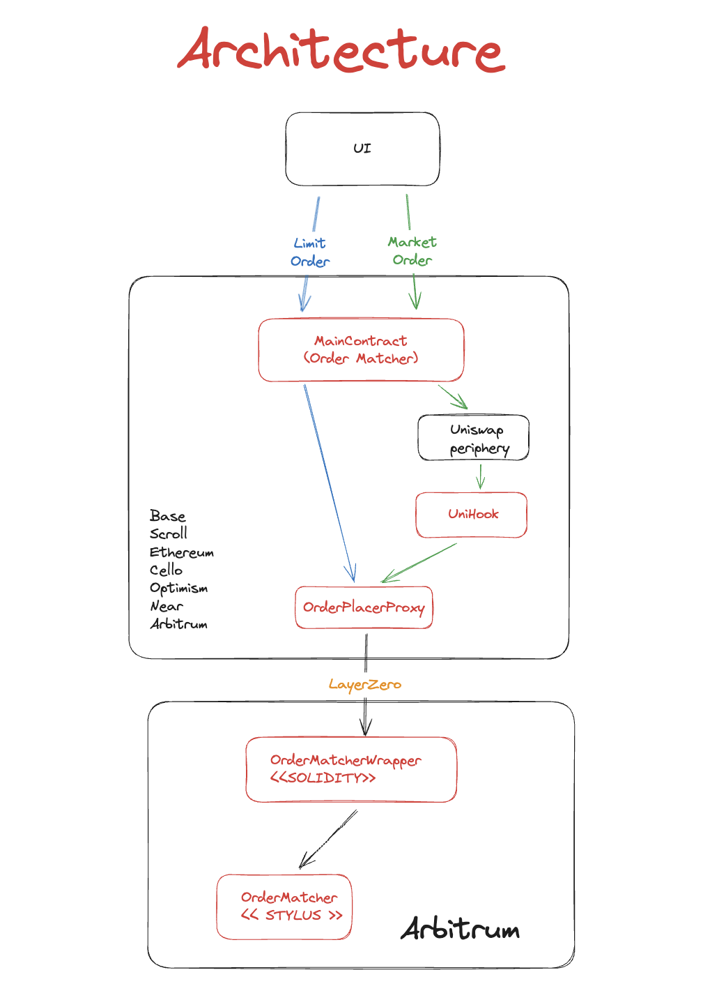

# IntegrumSwap 

This is our EthGlobal Brussels hackathon project.

*IntegrumSwap* is a decentralised *cross chain exchange* that inherits the best of two worlds: AMMs like Uniswap and Coincidence of Wants dexes like CoWSwap.


Uniswap runs on-chain and thus is decentralised, but we all know about the MEV and front-running issues. That happens mainly because AMMs do not work with fixed pricing of swaps and so someone can change the price of a token just before your order executes.
IntegrumSwap does not suffer from these issues because like CoW Swap, it uses coincidence of wants to fulfill trade orders.
CoW Swap uses off-chain order matching and thus is not decentralised and is vulnerable. IntegrumSwap runs the order matching engine on-chain using Arbitrum WASM VM. That is an order of magnitude faster than EVM with significantly lower gas fees. That is due to the superior efficiency of WASM programs. Also memory can be 100-500 times cheaper.

Neither Uniswap nor CoW Swap trades are cross chain. That means that we get into the problem of liquidity fragmentation for a trading pair. IntegrumSwap uses LayerZero to implement interoperability and thus works cross-chain.

For example a user holding tokens on Optimism can trade with a user that holds tokens on say - Ethereum. They do not have to go through bridging, swapping and bridging back to the source chain. Both traders get the counterpart tokens on their home chain.  
 
Integrum also implements Uniswap V4 and Pancake swap V4 hooks. If the users get better prices in local liquidity pool, the default swap logic is executed locally. Otherwise, if the user can get a better market order price on a remote chain, they go through LayerZero and the tokens are bridged accordingly across chains. 

We have deployed Integrum contracts on Ethereum Sepolia, Celo Alfajores, Base Sepolia, Scroll Sepolia, Linea Sepolia, BNB Smart Chain Testnet and Optimism Sepolia. The order matching engine is deployed on Arbitrum Sepolia.

### Architecture



### How to run

Build the main project.
```
forge build
```

Build Rust contract (Stylus)
```
cargo stylus check -e https://sepolia-rollup.arbitrum.io/rpc
```

Deploy OrderMatcher Rust contract
```
cargo stylus deploy --private-key=$PRIV_KEY -e https://sepolia-rollup.arbitrum.io/rpc
```

Frontend
```
cd ui
yarn install
yarn start
```
Open app on [http://localhost:3000](http://localhost:3000)

### Arbitrum Stylus

IntegrumSwap uses Arbitrum Stylus to implement an order matching engine to which all the limit and market orders are sent. It is written as a smart contract in Rust.
So what if we reach the limit that Arbitrum Stylus supports through it’s WASM VM? It should be easy to implement sharding with multiple matching engines each taking care of a slice of the orderbook.

The OrderMatching contract is implemented in Rust [here](order-matcher/src/lib.rs).

| Chain            | OrderMatcher                                | OrderMatcherWrapper                               
| ---------------- | ------------------------------------------- | ------------------------------------------ |
| Arbitrum         | 0xAEC85ff2A37Ac2E0F277667bFc1Ce1ffFa6d782A  | 0x3A274DD833726D9CfDb6cBc23534B2cF5e892347 |                                     

### LayerZero

To communitcate between chains, IntegrumSwap uses LayerZero. For the hackathon we have deployed end-points to Ethereum, Optimism, Scroll, Base and Celo. They are all Solidity contracts that send limit or market orders using LayerZero to the matching engine that lives on Arbitrum Stylus.
After the orders are matched, each individual endpoint uses OFT to settle the tokens.

### Uniswap V4

For market orders, IntegrumSwap implements a Uniswap hook. If the hook sees that there are better prices on other chains, instead of doing the swap with the local liquidity pool, it bypasses the default logic and sends a market order through LayerZero to the matching engine on Arbitrum Stylus. 

### PancakeSwap V4

For market orders, IntegrumSwap implements a PancakeSwap hook. If the hook sees that there are better prices on other chains, instead of doing the swap with the local liquidity pool, it bypasses the default logic and sends a market order through LayerZero to the matching engine on Arbitrum Stylus.

### Base

The contracts MainContract and OrderPlacerProxy were deployed on Base to enable cross-chain swaps via LayerZero.

### Scroll

The contracts MainContract and OrderPlacerProxy were deployed on Base to enable cross-chain swaps via LayerZero.

### Cello

The contracts MainContract and OrderPlacerProxy were deployed on Base to enable cross-chain swaps via LayerZero.

### Blockscout

By integrating Blockscout, we ensure that users can easily verify and audit transactions, enhancing transparency and trust in IntegrumSwap. 


#### Contract Addresses 

| Chain            | MainContract                                | OrderPlacerProxy                              
| ---------------- | ------------------------------------------- | ------------------------------------------ |
| Ethereum         | 0xAEC85ff2A37Ac2E0F277667bFc1Ce1ffFa6d782A  | 0x3A274DD833726D9CfDb6cBc23534B2cF5e892347 |                                          
| Linea            | 0xAEC85ff2A37Ac2E0F277667bFc1Ce1ffFa6d782A  | 0x3A274DD833726D9CfDb6cBc23534B2cF5e892347 |                                          
| Optimism         | 0x24b8cd32f93aC877D4Cc6da2369d73a6aC47Cb7b  | 0x58EE92DaDdF00334da39fb4Fab164c8662C794AD |                                          
| Scroll           | 0xf4661D0776Ee5171956b25417F7E320fE365C21E  | 0x3a6B3Aff418C7E50eE9F852D0bc7119296cc3644 |                                          
| Base             | 0xf4661D0776Ee5171956b25417F7E320fE365C21E  | 0x3a6B3Aff418C7E50eE9F852D0bc7119296cc3644 |                                          
| Cello            | 0xf4661D0776Ee5171956b25417F7E320fE365C21E  | 0x3a6B3Aff418C7E50eE9F852D0bc7119296cc3644 |                                          
| Binance          | 0xf4661D0776Ee5171956b25417F7E320fE365C21E  | 0x3a6B3Aff418C7E50eE9F852D0bc7119296cc3644 |
